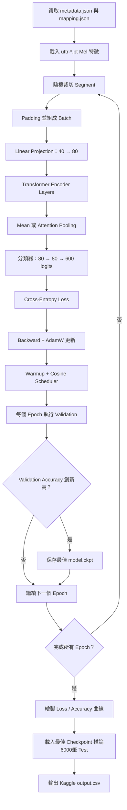

# ML2021 HW4 研究日誌：語者分類與 Self-Attention 實驗

## 1. 作業目標與最終成果

本作業使用語音的 Mel-spectrogram 特徵進行 **600 類語者分類（Speaker Classification）**。模型輸入不是原始音訊，而是課程預先轉換好的 `.pt` 特徵；模型必須根據一段語音判斷說話者 ID，最後輸出 Kaggle 要求的 `Id,Category` CSV。

本次從課程 baseline 的單層 Transformer Encoder 出發，依序研究：

1. Encoder Layer 數量。
2. Multi-Head Self-Attention 的 Head 數量。
3. 訓練 Segment 長度。
4. Epoch 與 Cosine Learning Rate Schedule 的訓練預算。
5. Mean Pooling 與 Attention Pooling。

最終模型結果：

| 指標 | 課程 Baseline | 最終 Attention Pooling | 絕對提升 |
|---|---:|---:|---:|
| Kaggle Public | 0.76428 | **0.91833** | **+0.15405** |
| Kaggle Private | 0.75888 | **0.91000** | **+0.15112** |
| 本地最佳 Validation Accuracy | 未記錄 | **86.85%** | — |
| 本地最低 Validation Loss | 未記錄 | **0.5565** | — |

最終架構為：

```text
2 Transformer Encoder Layers
4 Attention Heads
Segment Length 256
Batch Size 16
30 Epochs
Attention Pooling（80 → 64 → 1）
Dropout 0.1
Warmup + Cosine Learning Rate Schedule
```

---

## 2. 資料型態與標籤

### 2.1 資料規模

| 項目 | 數量 |
|---|---:|
| 語者類別 | 600 |
| 訓練語音特徵 | 69,438 |
| 實際 Train split（90%） | 62,494 |
| 實際 Validation split（10%） | 6,944 |
| Test 特徵 | 6,000 |

資料切分使用固定 `seed=87`，所以各次實驗的 Train/Validation 成員一致。

### 2.2 `.pt` 特徵

每個 `.pt` 檔案是一段語音的 log-Mel 特徵矩陣：

```text
(T, 40)
```

- `T`：語音包含的 frame 數，會因語音長度不同而改變。
- `40`：每個 frame 的40個 Mel 頻帶特徵。

訓練時，長語音會隨機裁切連續的 `segment_len` 個 frames。短語音則在組成 batch 時使用 `-20.0` 補齊。

### 2.3 Metadata、Mapping 與 Dataset 的關係

- `metadata.json`：記錄每位語者擁有哪些訓練 `.pt` 檔案。
- `mapping.json`：將文字 speaker ID 對應為模型使用的數字 label `0～599`。
- `testdata.json`：記錄 Kaggle 測試資料的特徵檔順序。
- `Dataset/*.pt`：模型真正讀取的 Mel-spectrogram 數值。

因此模型訓練時使用數字 label，推論後再透過 `id2speaker` 轉回文字 speaker ID。

---

## 3. 程式生命週期



每次實驗資料夾會保存：

```text
experiment_config.json
training_history.csv
loss_curve.png
accuracy_curve.png
model.ckpt
output.csv
```

---

## 4. Baseline 模型架構

### 4.1 Linear Projection

原始 frame 只有40維，先投影到 Transformer 使用的80維：

```text
(B, T, 40) → Linear(40, 80) → (B, T, 80)
```

### 4.2 Transformer Encoder Layer

每一個 Encoder Layer 不只有 Self-Attention，而是完整包含：

```text
Multi-Head Self-Attention
→ Residual Connection + LayerNorm
→ Feed-Forward Network（80 → 256 → 80）
→ Residual Connection + LayerNorm
```

Layer 之間是串接的；後一層接收前一層整理後的 frame 表示，所有 Layer 再透過同一個分類 Loss 共同訓練。

### 4.3 Mean Pooling

原始 baseline 對所有時間 frames 等權平均：

```python
pooled = encoded.mean(dim=1)
```

它計算快速、沒有額外參數，但靜音、雜訊、普通發音與高辨識力 frame 都具有相同權重。

### 4.4 分類器與 Loss

Pooling 後的80維摘要經過：

```text
Linear(80, 80) → ReLU → Linear(80, 600)
```

輸出600個 logits，再使用 `CrossEntropyLoss` 與正確語者 label 比較。Cross-Entropy 內部已包含 LogSoftmax，因此模型 forward 不需要自行做 Softmax。

---

## 5. Optimization 設定

### 5.1 AdamW

所有實驗使用：

```text
Optimizer：AdamW
Initial Learning Rate：0.001
```

### 5.2 Warmup + Cosine Decay

Learning Rate 是動態的：

1. 前 `0.25 epoch`：由接近0線性升至 `0.001`，避免 Transformer 初始化階段更新過大。
2. 後續 epochs：依 Cosine 曲線逐漸下降，讓前期快速探索、後期小步微調。
3. 最後一個 step：Learning Rate 按預定排程降至0。

需要注意：Scheduler 不會判斷模型是否已經收斂。LR 降到0只代表指定的訓練預算結束，不代表模型必然訓練充分。

### 5.3 Checkpoint 策略

每個 epoch 執行一次 Validation，只要 Validation Accuracy 創新高，就覆寫實驗資料夾中的 `model.ckpt`。訓練結束後，程式會自動使用最佳 checkpoint 產生 `output.csv`，而不是使用最後一輪模型。

---

## 6. 完整實驗成績總覽

| 實驗 | Layer | Head | Segment | Epoch | Pooling | 最佳 Valid Acc | 最低 Valid Loss | Public | Private |
|---|---:|---:|---:|---:|---|---:|---:|---:|---:|
| 課程 Baseline | 1 | 2 | 128 | Steps制 | Mean | — | — | 0.76428 | 0.75888 |
| E1：Epoch版基準 | 1 | 2 | 128 | 18 | Mean | 60.46% | 1.7154 | 0.73690 | 0.72166 |
| E2：增加 Encoder Layer | 2 | 2 | 128 | 18 | Mean | 66.13% | 1.4360 | 0.79904 | 0.80000 |
| E3：增加 Attention Heads | 2 | 4 | 128 | 20 | Mean | 69.20% | 1.3213 | 0.83285 | 0.81000 |
| E4：Segment 192 | 2 | 4 | 192 | 20 | Mean | 76.63% | 0.9740 | 0.86023 | 0.84666 |
| E5：Segment 256 | 2 | 4 | 256 | 20 | Mean | 81.41% | 0.7913 | 0.86714 | 0.85777 |
| E6：延長至30 Epochs | 2 | 4 | 256 | 30 | Mean | 83.73% | 0.6919 | 0.89238 | 0.89611 |
| E7：Attention Pooling | 2 | 4 | 256 | 30 | Attention | **86.85%** | **0.5565** | **0.91833** | **0.91000** |

除 E3 同時由18調整為20 epochs 外，其餘主要實驗均採逐步固定最佳設定、只修改一個核心變因的方式。

---

## 7. 實驗一：Epoch 版單層基準

### 設定

```text
1 Layer / 2 Heads / Segment 128 / Batch 16 / 18 Epochs / Mean Pooling
```

### 結果

```text
Best Validation Accuracy：60.46%（Epoch 17）
Minimum Validation Loss：1.7154（Epoch 17）
Public：0.73690
Private：0.72166
```

Train Loss 持續下降，但 Validation 在 Epoch 15～18 約停在60%，顯示模型已接近此設定的能力上限。分數低於課程 baseline，說明單層、小 Segment 的表示能力有限，而且 epoch、batch size、seed、裁切與 scheduler 等訓練 recipe 都會影響一次實驗結果。

---

## 8. 實驗二：Encoder Layer 1 → 2

### 想回答的問題

一層 Encoder 只能進行一次「Self-Attention 關係整理 + FFN 特徵加工」。加入第二層後，模型能再利用第一層輸出建立更高階的語音關係。

### 結果

| 指標 | 1 Layer | 2 Layers | 改善 |
|---|---:|---:|---:|
| Valid Accuracy | 60.46% | **66.13%** | **+5.67%** |
| Valid Loss | 1.7154 | **1.4360** | **-0.2794** |
| Public | 0.73690 | **0.79904** | **+0.06214** |
| Private | 0.72166 | **0.80000** | **+0.07834** |

本地 Validation 與 Kaggle 同步改善，證明增加的是有效模型容量，而不是只讓模型更容易記住 Train 資料。

---

## 9. 實驗三：Attention Heads 2 → 4

### 原理

`d_model=80` 保持不變，因此 Head 增加不是讓總維度變大，而是重新切分：

```text
2 Heads：每個 Head 40維
4 Heads：每個 Head 20維
```

更多 Heads 讓每層可以同時從更多子空間觀察 frame 關係，但每個 Head 的表示維度也變小。

### 結果

| 指標 | 2 Heads | 4 Heads |
|---|---:|---:|
| Valid Accuracy | 66.13% | **69.20%** |
| Valid Loss | 1.4360 | **1.3213** |
| Public | 0.79904 | **0.83285** |
| Private | 0.80000 | **0.81000** |

四頭模型在 Epoch 18 的 Validation Accuracy 已達68.81%，仍高於兩頭模型的最佳66.13%，所以改善主要來自 Head 數，而不只是多出的兩個 epochs。

---

## 10. 實驗四至五：Segment 128 → 192 → 256

### Segment 的意義

Segment 決定每次訓練讓模型看到多少連續語音 frames。更長的 Segment 能提供更多音色、節奏與前後發音資訊，但 Self-Attention 的主要計算量約與 `T²` 成長。

```text
128² = 16,384
192² = 36,864
256² = 65,536
```

### 結果

| Segment | Valid Accuracy | Public | Private |
|---:|---:|---:|---:|
| 128 | 69.20% | 0.83285 | 0.81000 |
| 192 | 76.63% | 0.86023 | 0.84666 |
| 256 | **81.41%** | **0.86714** | **0.85777** |

分段提升：

```text
128 → 192：Private +3.67 個百分點
192 → 256：Private +1.11 個百分點
```

Segment 變長確實有效，代表說話者辨識需要足夠的語音上下文；但192到256的提升縮小，開始出現邊際效益遞減。所有實驗仍維持 `batch_size=16`，因此差異可以較乾淨地歸因於 Segment。

---

## 11. 實驗六：20 → 30 Epochs

### 為什麼延長？

S256 E20 的最高 Validation Accuracy 與最低 Validation Loss 都出現在最後一輪，表示模型雖然完成20-epoch Cosine 排程，但可能尚未充分收斂。由於 Epoch 20 的 LR 已按排程降到0，不能直接繼續有效更新，因此重新執行30-epoch完整排程。

### 結果

| 指標 | 20 Epochs | 30 Epochs | 改善 |
|---|---:|---:|---:|
| Valid Accuracy | 81.41% | **83.73%** | **+2.32%** |
| Valid Loss | 0.7913 | **0.6919** | **-0.0994** |
| Public | 0.86714 | **0.89238** | **+0.02524** |
| Private | 0.85777 | **0.89611** | **+0.03834** |

30-epoch模型在 Epoch 29 得到最高 Validation Accuracy，Epoch 27～30逐漸平台化，表示30 epochs 比20更符合 S256 模型所需的訓練預算。

此實驗也說明：

> LR 變成0不是模型自己宣告完成，而是 Scheduler 按照預設訓練期限結束；是否訓練充分仍應觀察 Validation 曲線。

---

## 12. 實驗七：Mean Pooling → Attention Pooling

### 12.1 動機

Segment 增加到256後，Mean Pooling 仍把所有 frames 等權平均，可能讓重要發音被靜音、雜訊或普通 frame 稀釋。因此加入小型 Attention Pooling，讓模型自行學習每個 frame 的重要性。

### 12.2 架構

```text
encoded：(B, 256, 80)
→ Linear(80, 64)
→ Tanh
→ Dropout(0.1)
→ Linear(64, 1)
→ Softmax over frames
→ 加權平均得到 (B, 80)
```

概念公式：

```text
score_t = PoolingNetwork(frame_t)
weight_t = Softmax(score_t)
pooled = Σ weight_t × frame_t
```

Self-Attention 與 Attention Pooling 的用途不同：

- Self-Attention：讓各 frame 互相交換與整合資訊。
- Attention Pooling：最後決定哪些 frame 對整段語音分類最重要。

### 12.3 結果

| 指標 | Mean Pooling | Attention Pooling | 改善 |
|---|---:|---:|---:|
| Valid Accuracy | 83.73% | **86.85%** | **+3.12%** |
| Valid Loss | 0.6919 | **0.5565** | **-0.1354** |
| Public | 0.89238 | **0.91833** | **+0.02595** |
| Private | 0.89611 | **0.91000** | **+0.01389** |

最佳 Validation Accuracy 出現在 Epoch 27；Epoch 28～30維持約86.6%，顯示模型已接近平台。最後 Train Accuracy 95.81%、Validation Accuracy 86.65%，差距約9.16%，沒有比 Mean Pooling 最後約9.75%的差距更嚴重。因此保留的小型打分網路與 Dropout 沒有造成明顯額外過擬合。

---

## 13. Training Curve 的判讀方式

### 尚未收斂

```text
Train Loss 與 Validation Loss 仍下降
Train Accuracy 與 Validation Accuracy 仍上升
最佳結果持續出現在最後一輪
```

### 已接近收斂

```text
Validation Accuracy 連續多輪沒有創新高
Validation Loss 已平台化
後期只有小幅波動
```

### 過擬合

```text
Train Accuracy 持續提高
Train Loss 持續下降
但 Validation Accuracy 下降、Validation Loss 上升
```

本次最終 Attention Pooling 在 Epoch 27 達到最佳 Accuracy，之後三輪平台化，因此30 epochs 已經合理，不需再盲目增加到40。

---

## 14. 最終模型為什麼有效

### 14.1 兩層 Encoder 提供分階段特徵整理

第一層建立較直接的 frame 關係，第二層再組合第一層輸出。Residual Connection 保留既有資訊，LayerNorm 幫助數值穩定，FFN 則逐 frame 加工 Attention 整合後的內容。

### 14.2 四個 Heads 提供更多關係子空間

總維度仍為80，但模型能以四個20維 Head 同時學習不同形式的語音關係。本資料中，多角度關係建模帶來穩定提升。

### 14.3 Segment 256 提供較完整的聲紋上下文

更長片段包含更多音色、節奏與發音變化。128到192提升最大，192到256仍有提升但呈現邊際效益遞減。

### 14.4 30 Epochs 給予長 Segment 足夠訓練預算

模型與輸入資訊變多後，20-epoch Cosine Schedule 太早結束；30輪讓中後期仍保有有效 LR，再逐步微調至收斂。

### 14.5 Attention Pooling 避免重要 frame 被平均稀釋

模型不再假設所有 frames 同等重要，而是透過分類 Loss 學習加權摘要，因此在長 Segment 上能更有效使用額外資訊。

---

## 15. 實驗限制與可重現性

1. 每次訓練仍受初始化、GPU運算與隨機裁切影響；單次結果不等於完全確定的因果證明。
2. Train/Validation split 以 `seed=87` 固定，但 Validation 使用與 Train 相同的 Dataset，長語音在每次讀取時仍會隨機裁切，因此 Validation 數字帶有小幅抽樣波動。
3. E3 同時將 Heads 由2改成4、Epochs 由18改成20，不是完全單變因；不過四頭模型在 Epoch 18 的 Validation 已高於兩頭最佳值，仍支持增加 Head 有效。
4. Kaggle Public 與 Private 是不同測試子集，Public 較高不保證 Private 同步提高；本次所有核心改善均同時參考本地 Validation 與兩個 Kaggle 分數。
5. Attention Pooling 的權重尚未視覺化，因此可以確認它有效，但尚不能直接聲稱每個 Head 或 Pooling 具體關注了音高、節奏或某種特定發音。
6. Padding 尚未傳入 Transformer padding mask，短語音的補值可能參與 Attention 與 Pooling；這是後續可改善但本次未改動的部分。

---

## 16. 最終模型重現方式

### 環境

```text
Python virtual environment：.venv
PyTorch：2.5.1+cu121
GPU：NVIDIA GeForce RTX 3050 Laptop GPU
CUDA available：True
```

### 訓練指令

```powershell
cd <repository-path>\ml2021\hw04-speaker-classification

.\.venv\Scripts\python.exe hw04.py train `
  --epochs 30 `
  --num-layers 2 `
  --nhead 4 `
  --segment-len 256 `
  --batch-size 16 `
  --pooling attention `
  --pooling-hidden 64 `
  --dropout 0.1 `
  --run-dir experiments\L2_H4_S256_E30_ATTNPOOL
```

訓練完成後會自動使用最佳 checkpoint 產生：

```text
experiments\L2_H4_S256_E30_ATTNPOOL\output.csv
```

### 單獨重新推論

```powershell
.\.venv\Scripts\python.exe hw04.py infer `
  --run-dir experiments\L2_H4_S256_E30_ATTNPOOL `
  --workers 0
```

Checkpoint 內保存 `num_layers`、`nhead`、`pooling` 等模型設定，推論時會自動重建正確架構。舊 Mean Pooling checkpoint 也保持相容。

---

## 17. 本次作業應掌握的核心知識

### Data

- 模型輸入是 `(T, 40)` 的 Mel-spectrogram，不是原始音訊。
- `mapping.json` 將 speaker 文字 ID 轉為 `0～599` 數字 label。
- Segment 控制每次看到的連續語音上下文，長度與 Attention 成本約呈平方關係。

### Model

- Self-Attention 負責不同 frames 之間的資訊交換。
- Multi-Head 將80維拆成多個子空間，而不是直接增加總維度。
- Encoder Layer 同時包含 Attention、Residual、LayerNorm 與 FFN。
- FFN 對每個 frame 個別加工已整合的資訊。
- Attention Pooling 在分類前學習哪些 frames 最重要。

### Loss 與 Optimization

- Cross-Entropy 衡量600類 logits 與正確 speaker label 的差距。
- Backpropagation 讓分類器、Pooling、所有 Encoder Layers 與 Projection 一起更新。
- Warmup 避免 Transformer 初期更新過大。
- Cosine Decay 讓後期步伐縮小、減少最佳區域附近震盪。
- Scheduler 的終點是人為訓練預算，不是模型自動判斷的收斂點。

### Evaluation

- Train 表現只能反映對訓練資料的擬合程度。
- Validation 用於選擇 checkpoint 與判斷收斂、過擬合。
- Kaggle Public 用於即時回饋，Private 才是最終隱藏測試表現。
- 最終提交應選擇 Attention Pooling `0.91000 Private` 與 Mean Pooling E30 `0.89611 Private` 兩組最佳結果。

---

## 18. 結論

本次作業不是單純把模型變大，而是依照實驗結果逐步找出瓶頸：

```text
單層表示能力不足
→ 增加第二層 Encoder
→ 增加 Attention Heads
→ 提供更長語音 Segment
→ 延長 Scheduler 訓練預算
→ 用 Attention Pooling 取代等權平均
```

最終 Private Score 從 baseline `0.75888` 提升至 `0.91000`，增加 `0.15112`；Public Score 從 `0.76428` 提升至 `0.91833`。最關鍵的學習是：模型深度、Head、上下文長度、Optimization 與 Pooling 不是互相獨立的技巧，而是一套共同決定資訊如何被觀察、整理、摘要與學習的完整系統。
